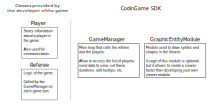
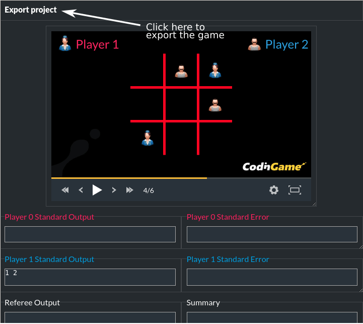

# CodinGame SDK

The CodinGame SDK is a Java project that allows you to write programming games for [CodinGame](https://www.codingame.com).

A game is divided into 2 parts: the **referee** and the **viewer**. The **referee** is a program that implements the game rules. It will communicate with the players and at the end it will assign a score to each player. The **viewer** displays the game using *frames* sent by the **referee**.

The CodinGame SDK provides the main classes to write the **referee** and a **viewer**. A module called **GraphicEntityModule** allows the display of sprites and shapes directly from the **referee** code. If you want to do something more advanced, it's possible to write your own module.

# Main Classes

A game must at least contains the classes `Referee` and `Player`, which inherit from the classes `AbstractReferee` and `AbstractPlayer` respectively.

The `Referee` class must implement the methods `init` and `gameTurn`. The `Player` class is mainly used to communicate with the agent (you must give the input, then read the output).

The entry point of the game is the class `GameManager`. The `GameManager` calls the `Referee` on each turn, and sends data to the viewer.



# Getting started

This document will show you, through the simple game "Tic-tac-toe" how to create your own game and test it.

The source code is available on GitHub: [https://github.com/CodinGame/game-tictactoe](https://github.com/CodinGame/game-tictactoe)

## Requirements

All you need is a Java IDE such as [Eclipse](https://www.eclipse.org/) or [IntelliJ](https://www.jetbrains.com/idea/) and a git client to clone the example.

⚠ To use the game viewer locally, your browser must support ES6 JavaScript modules. For Chrome, that's version 61 or more. For Firefox, from version 54 this feature is behind the dom.moduleScripts.enabled preference. To change preferences in Firefox, visit about:config.

## Import project

First of all, you need to download the source code of the game:
```
git clone https://github.com/CodinGame/game-tictactoe.git
```

Then, import this project as an existing maven project into your IDE:
- Eclipse: File > Import > Existing Maven Projects
- IntelliJ IDEA: Import Project > Select game-tictactoe > Import project from external model > Maven

## Project Hierarchy

Here's the file hierarchy for the project Tic-tac-toe:
```
.
├── config
│   ├── Boss.java
│   ├── config.ini
│   └── statement_en.html
├── pom.xml
├── README.md
├── src
│   ├── main
│   │   ├── java
│   │   │   └── com
│   │   │       └── codingame
│   │   │           └── game
│   │   │               ├── Player.java
│   │   │               └── Referee.java
│   │   └── resources
│   │       └── view
│   │           ├── assets
│   │           │   └── Background.jpg
│   │           └── config.js
│   └── test
│       ├── java
│       │   ├── Main.java
│       │   ├── Player1.java
│       │   └── Player2.java
│       └── resources
│           └── log4j2.properties
```

- **./config:** contains the settings such as the game title, statement, number of players, etc.
- **./src/main/java:** source code of the game itself
- **./src/main/resources:** graphical assets and configuration of the view
- **./src/test/java:** classes used for local development (AI codes to test your game)

## Launch the game

The class to run is test/java/Main.java. This will launch a [web server](http://localhost:8888/) to serve a page with the viewer of the game.



Use this page to see the rendering of your game. It also allows you to export a zip archive of the game.

## Deploy on codingame

Go to [www.codingame.com](https://www.codingame.com), then click on **Contribute** > **Create a new puzzle** > **Multiplayer Game** (This section is not available to anyone yet, please contact us if you want the access).

Then, import on CodinGame the game you have exported during the previous step. The game will be compiled on our servers and a preview link will appear if the compilation succeeded and if the configuration is correct.

## Create Your Own Game

Now that you are able to start a game on your computer and export it to CodinGame, you can start creating your own game. For that, it is suggested you start with the Skeleton: [https://github.com/CodinGame/game-skeleton](https://github.com/CodinGame/game-skeleton)

You can also read the code of others games (see below). More advanced documentation is available there: [https://github.com/CodinGame/codingame-game-engine](https://github.com/CodinGame/codingame-game-engine)

If you do not have an artistic mind, we provide a [Github asset repository](https://github.com/CodinGame/codingame-sdk-assets) with a lot of free graphical resources to bootstrap your game.

# Resources

- [Javadoc](https://codingame.github.io/codingame-sdk-doc/)
- [SDK source and documentation](https://github.com/CodinGame/codingame-game-engine)
- [Free to use graphical assets](https://github.com/CodinGame/codingame-sdk-assets)
- [Game Skeleton](https://github.com/CodinGame/game-skeleton)
- [Contribute Page](https://www.codingame.com/contribute/)
- [Tic-tac-toe Game](https://github.com/CodinGame/game-tictactoe)
- [Pong Game](https://github.com/CodinGame/game-pong)
- [JavaScript Module Examples](https://github.com/CodinGame/game-modules)

# Contact

Feel free to [contact us](https://www.codingame.com/about/contact) if you need some help to get started.
